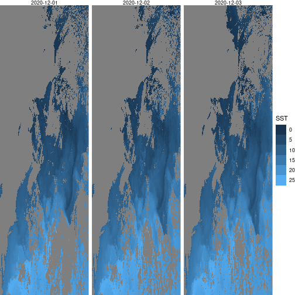

Center for Ocean Forecasting
========================================================
author: Ben Tupper (btupper@bigelow.org)
date: 2021-05-11
autosize: true


Data Sources
========================================================
title: false
**Observation Sources**

 - Satellites (OBPG, MUR, Copernicus, ...)
 - Buoys
 - Weather stations
 - Interpolated historical weather (DAYMET)
 - River flow
 - Species Observations
***
**Model Sources**

 - NOAA/NWS weather models
 - RTOFS ocean models
 - NECOFS ocean models


Example Satellite Data
========================================================

```r
data_path = obpg_path("nwa", "AQUA_MODIS", "L3m")
db = read_database(data_path)
db
```

```
# A tibble: 94,950 x 11
   date       year  mmdd  mit    lvl   per   suite param  res   nrt   file      
   <date>     <chr> <chr> <chr>  <chr> <chr> <chr> <chr>  <chr> <chr> <chr>     
 1 2004-01-01 2004  0101  AQUA_… L3m   DAY   CHL   chlor… 4km   <NA>  AQUA_MODI…
 2 2004-01-01 2004  0101  AQUA_… L3m   DAY   PAR   par    4km   <NA>  AQUA_MODI…
 3 2004-01-01 2004  0101  AQUA_… L3m   DAY   PIC   pic    4km   <NA>  AQUA_MODI…
 4 2004-01-01 2004  0101  AQUA_… L3m   DAY   POC   poc    4km   <NA>  AQUA_MODI…
 5 2004-01-01 2004  0101  AQUA_… L3m   DAY   SST   sst    4km   <NA>  AQUA_MODI…
 6 2004-01-02 2004  0102  AQUA_… L3m   DAY   CHL   chlor… 4km   <NA>  AQUA_MODI…
 7 2004-01-02 2004  0102  AQUA_… L3m   DAY   PAR   par    4km   <NA>  AQUA_MODI…
 8 2004-01-02 2004  0102  AQUA_… L3m   DAY   PIC   pic    4km   <NA>  AQUA_MODI…
 9 2004-01-02 2004  0102  AQUA_… L3m   DAY   POC   poc    4km   <NA>  AQUA_MODI…
10 2004-01-02 2004  0102  AQUA_… L3m   DAY   SST   sst    4km   <NA>  AQUA_MODI…
# … with 94,940 more rows
```

Pull SST December 2020
========================================================

```r
db_sst = db %>%
  filter(param == "sst" &
         per == "8DR" &
         between(date, as.Date("2020-12-01"), as.Date("2020-12-31")))
db_sst
```

```
# A tibble: 31 x 11
   date       year  mmdd  mit    lvl   per   suite param res   nrt   file       
   <date>     <chr> <chr> <chr>  <chr> <chr> <chr> <chr> <chr> <chr> <chr>      
 1 2020-12-01 2020  1201  AQUA_… L3m   8DR   SST   sst   4km   <NA>  AQUA_MODIS…
 2 2020-12-02 2020  1202  AQUA_… L3m   8DR   SST   sst   4km   <NA>  AQUA_MODIS…
 3 2020-12-03 2020  1203  AQUA_… L3m   8DR   SST   sst   4km   <NA>  AQUA_MODIS…
 4 2020-12-04 2020  1204  AQUA_… L3m   8DR   SST   sst   4km   <NA>  AQUA_MODIS…
 5 2020-12-05 2020  1205  AQUA_… L3m   8DR   SST   sst   4km   <NA>  AQUA_MODIS…
 6 2020-12-06 2020  1206  AQUA_… L3m   8DR   SST   sst   4km   <NA>  AQUA_MODIS…
 7 2020-12-07 2020  1207  AQUA_… L3m   8DR   SST   sst   4km   <NA>  AQUA_MODIS…
 8 2020-12-08 2020  1208  AQUA_… L3m   8DR   SST   sst   4km   <NA>  AQUA_MODIS…
 9 2020-12-09 2020  1209  AQUA_… L3m   8DR   SST   sst   4km   <NA>  AQUA_MODIS…
10 2020-12-10 2020  1210  AQUA_… L3m   8DR   SST   sst   4km   <NA>  AQUA_MODIS…
# … with 21 more rows
```

compose SST filenames
========================================================

```r
sst_files = compose_obpg(db_sst, data_path)
head(sst_files, n = 6)
```

```
[1] "/mnt/ecocast/coredata/obpg2/nwa/AQUA_MODIS/L3m/2020/1201/AQUA_MODIS.20201201.L3m.8DR.SST.sst.4km.tif"
[2] "/mnt/ecocast/coredata/obpg2/nwa/AQUA_MODIS/L3m/2020/1202/AQUA_MODIS.20201202.L3m.8DR.SST.sst.4km.tif"
[3] "/mnt/ecocast/coredata/obpg2/nwa/AQUA_MODIS/L3m/2020/1203/AQUA_MODIS.20201203.L3m.8DR.SST.sst.4km.tif"
[4] "/mnt/ecocast/coredata/obpg2/nwa/AQUA_MODIS/L3m/2020/1204/AQUA_MODIS.20201204.L3m.8DR.SST.sst.4km.tif"
[5] "/mnt/ecocast/coredata/obpg2/nwa/AQUA_MODIS/L3m/2020/1205/AQUA_MODIS.20201205.L3m.8DR.SST.sst.4km.tif"
[6] "/mnt/ecocast/coredata/obpg2/nwa/AQUA_MODIS/L3m/2020/1206/AQUA_MODIS.20201206.L3m.8DR.SST.sst.4km.tif"
```

read SST files
========================================================

```r
sst = read_stars(sst_files, along = 'band') %>%
  st_set_dimensions(which = 'band', values = db_sst$date)
sst
```

```
stars object with 3 dimensions and 1 attribute
attribute(s), summary of first 1e+05 cells:
 AQUA_MODIS.20201201.L3m.8DR.SST.sst.4km.tif 
 Min.   :-1.67                               
 1st Qu.: 1.15                               
 Median : 3.76                               
 Mean   : 3.31                               
 3rd Qu.: 4.45                               
 Max.   :11.19                               
 NA's   :86533                               
dimension(s):
     from  to     offset      delta refsys point values x/y
x       1 830   -77.0417  0.0416667 WGS 84 FALSE   NULL [x]
y       1 487      56.75 -0.0416667 WGS 84 FALSE   NULL [y]
band    1  31 2020-12-01     1 days   Date    NA   NULL    
```

plot SST rasters
========================================================

